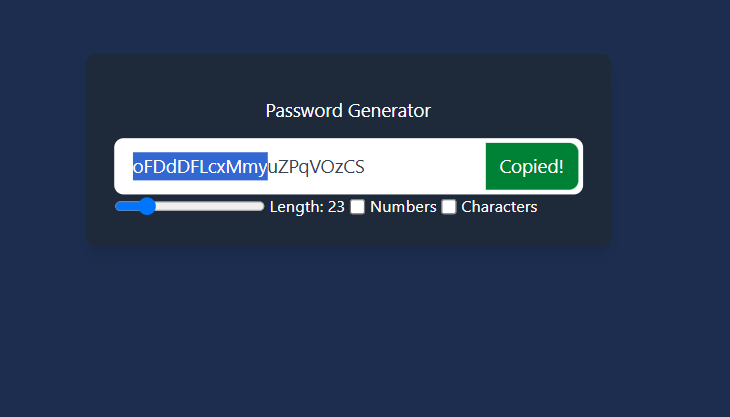

# 🔑 Password Generator

A simple and stylish **Password Generator** built using **React + Vite**. This project provides a sleek UI for generating passwords with a modern design. 🚀

---

## 🎯 Features
✅ **Minimal & Clean UI** - Dark-themed interface with a user-friendly design.  
✅ **Editable Input Field** - Type or copy your password easily.  
✅ **React + Vite** - Fast and optimized for development.  
✅ **TailwindCSS Styling** - Elegant and responsive design.  

---

## 🛠️ Installation & Setup

Follow these steps to set up and run the project:  

1️⃣ **Create a new project using Vite + React**  
2️⃣ **Navigate into the project folder**  
3️⃣ **Install dependencies**  
4️⃣ **Replace the existing `src` folder with the one provided in this repository**  
5️⃣ **Run the project**  

## 📷 Preview

---
